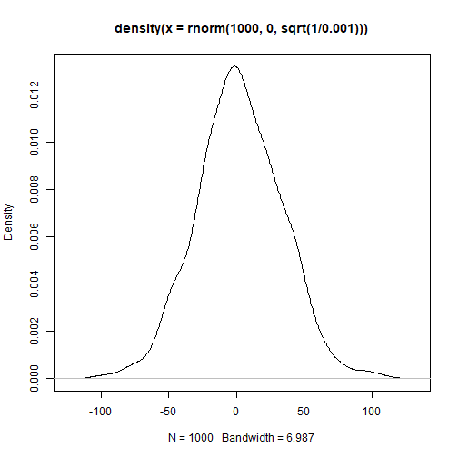

## Introduction

As INLA conducts Bayesian analyses, users must specify the priors for different parameters, or at least you need to accept the default values. Generally, for a mixed model, users must consider priors for the fixed effects, random effects, as well as the distributions. Here, I will demonstrate how to manually specify the prior and run CPR. Additionally, I will also demonstrate how to include other random effects in the model.

Again let's load the data first.


```r
library(phytools)
library(tidyverse)
library(CPR)
data("KSR")
data("KSR_MLtree")
data("KSR_EF")

VCV_sp <- vcv(KSR_MLtree) #species level phyologenetic covariance matrix using default (Brownian) model
VCV_sp <- VCV_sp[order(rownames(VCV_sp)),order(colnames(VCV_sp))]
VCV_comm <- get_comm_pair_r(KSR,VCV_sp)
```

## Making it more complicated

Imagine the BEF experiment in KSR has a blocked design (it doesn't), so we add one more column "block" in the data. Theoretically, this blocking structure should be addressed by adding a random intercept. In popular package such as lme4 or glmmTMB, we will use (1|block) to represent the random intercept.

Generally, you might wish to control for other structures in your data, such as spatial and temporal structures. INLA is capable of handling all of these, and please refer to [other INLA resources](https://becarioprecario.bitbucket.io/inla-gitbook/ch-spatial.html) if you need to do so.

Now let's generate a fake blcoking structure.

```r
KSR_EF$block <- sample(1:7,88,replace=T)
head(KSR_EF)
```

```
##   Plot Real.rich litter2012 ave.biomass  LAI mean.N.change poll_total flwr_total Mass.loss.2month Damage_effect bugs bug.rich
## 1   X2         1      79.05    32.97333 1.67       -0.0015         20 43113.5000            3.362     0.0000000    9        7
## 2   X3         4      74.23    82.41000 5.53       -0.0275         53  2126.1429            3.718     0.3001195    7        6
## 3   X4         2      34.50    62.92667 3.04        0.0060        150   324.4286            3.521     0.4195279    4        2
## 4   X7         1      36.32    34.38333 3.42       -0.0575          0     0.0000            3.328     0.0000000    5        3
## 5   X8         3      21.46   147.05667 7.14       -0.0070          0     0.0000            3.608     2.7460093    4        4
## 6   X9         1      37.26    33.80333 1.01        0.0415          0     0.0000            3.627     0.0000000   11        7
##   block
## 1     7
## 2     4
## 3     4
## 4     7
## 5     1
## 6     6
```

## Run the model!

To run a model with both phylogenetic and spatial (here as block) random effects, just run the following.


```r
inla_m <- CPR(formula = LAI~Real.rich+
                 f(comm,model="generic0",Cmatrix=Phylo)+
                 f(block,model="iid"),
               priors=NULL,
               df = KSR_EF,
               VCV_sp = VCV_sp,
               comm=KSR,
               family="gaussian",
               optim.lambda = T)
```

```
## [1] "LAI"
```

This, however, will use default priors for everything. Have a look at the prior specifications. Note that INLA uses precision instead of variance.

Run these functions to examine what priors are actually used in your model.

```r
inla_m$best_model$.args$control.fixed #gaussian distribution, original scale
inla_m$best_model$.args$control.family[[1]]$hyper$theta1 #hyperparameter
inla_m$best_model$all.hyper$random[[1]]$hyper$theta$prior #hyperparameter
inla_m$best_model$all.hyper$random[[1]]$hyper$theta$param #hyperparameter
inla_m$best_model$all.hyper$random[[2]]$hyper$theta$prior #hyperparameter
inla_m$best_model$all.hyper$random[[2]]$hyper$theta$param #hyperparameter
```

## Notes on internal calculations of INLA
Apart from the fixed effects, which uses a gaussian distribution, all other parameters are estimated using logGamma distribution. This is because the internal calculations are conducted at log scale before back-transforming them to the original scale. Therefore, the priors must be specificed at log scale too. You can use inla.doc() to check the internal calculations of different distributions and priors. For gaussian distribution, use inla.doc("Gaussian").

Note that if the log-transformed hyperparameters follow logGamma(a,b), the original hyperparameters follow Gamma(a,b). Read inla.doc("Gamma") to learn more!

You can use other functions to get a sense of what the prior looks like.

```r
plot(density(rnorm(1000,0,sqrt(1/0.001))))
```



## Using manual priors

Let's say we don't like these priors and want to change it a bit. We will create different objects storing our priors. Note that here I am just demonstrating how to manually specify the priors and run CPR, not the thought process to construct meaningful priors.


```r
prior.fixed <- list(prec.intercept = 0.001,prec = 0.005)
prior.family <-  list(hyper=list(theta1 = list(prior="loggamma",param = c(1,4e-5))))
prior.phy <- list(prec=list(prior="loggamma",param=c(0.1,0.1)))
prior.block <- list(prec=list(prior="loggamma",param=c(1,4e-5)))
```

Then just put all of these priors in different arguments. Notet that for the blocking random effects, we will still use the default one.


```r
inla_m2 <- CPR(formula = LAI~Real.rich+
                 f(comm,model="generic0",Cmatrix=Phylo,hyper=prior.phy)+
                 f(block,model="iid"),
              priors=list(prior.phy=prior.phy,prior.block=prior.block),
              df = KSR_EF,
              VCV_sp = VCV_sp,
              comm=KSR,
              family="gaussian",
              optim.lambda = T,
              control.fixed = prior.fixed,
              control.family = prior.family)
```

```
## [1] "LAI"
```

You only need to specify the manual prior in \code{priors}. For example, if you want to use the default prior for block, just use list(prior.phy=prior). Note that the name of the priors shouldn't contain the word "Phylo" - it is designated to hold the communtiy phylogenetic covariance matrix. If you name the prior with the word "Phylo", an error would occur.

Now check the priors again!

```r
inla_m2$best_model$.args$control.fixed #gaussian distribution, original scale
inla_m2$best_model$.args$control.family[[1]]$hyper$theta1 #hyperparameter
inla_m2$best_model$all.hyper$random[[1]]$hyper$theta$prior #hyperparameter
inla_m2$best_model$all.hyper$random[[1]]$hyper$theta$param #hyperparameter
inla_m2$best_model$all.hyper$random[[2]]$hyper$theta$prior #hyperparameter
inla_m2$best_model$all.hyper$random[[2]]$hyper$theta$param #hyperparameter
```
## Thoughts on priors
So how should we specify our priors? Well there are a lot of debates on that and you are encouraged to visit the literature. If you choose to use the default ones, you have to understand what the values are. Many studies prefer using non-informative priors to minimize their influences on the results (i.e., the results are strongly driven by the data instead of the priors), but there are also good reasons to use informative priors, especially when the sample size is low. In fact this is one of the major advantage of Bayesian analyses!

Note that default priors are not always non-informative! For example, if you specify the fixed effect priors as \eqn{N(0,1)}, they might be non-informative if you have standardized the responses and predictors, given biological relationships are rarely that strong (like increasing the responses by more than 1 SD when the predictors increase by 1 SD). However, if you run the analyses in the original scale, it becomes more tricky, because the slope can change according to the unit of the responses and the predictors. For example, if body mass increases by 0.01kg per unit temperature, converting the unit to g will completely change the magnitude of slope (i.e, 10gram)!
