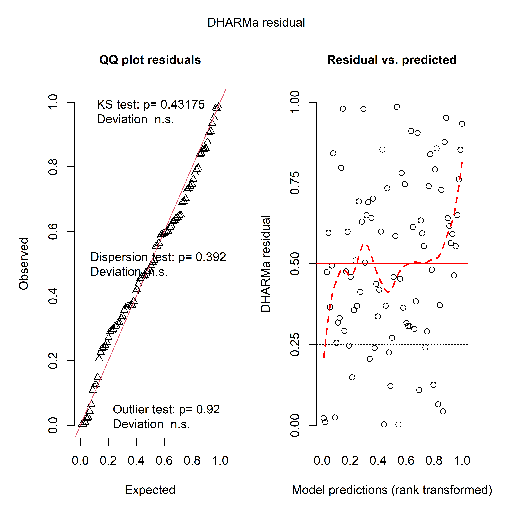
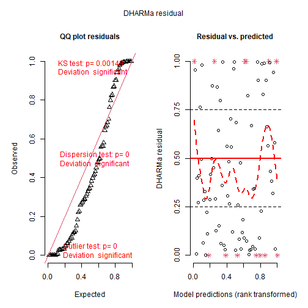
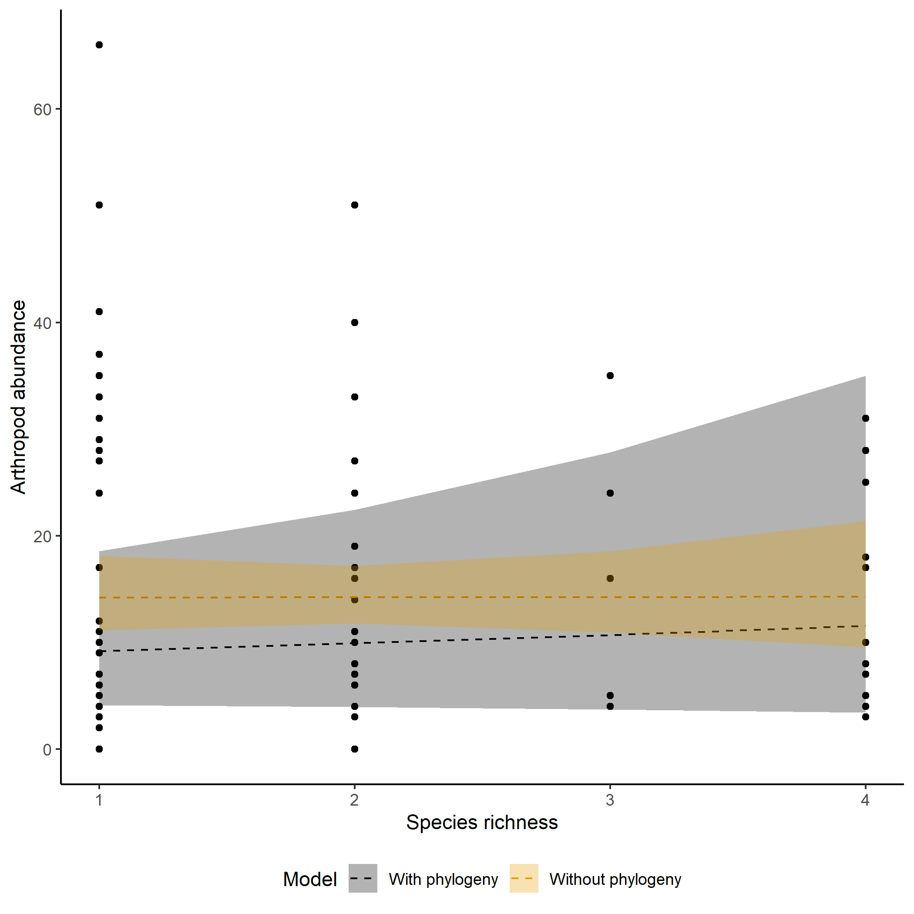

## Setup


This is an R Markdown document describing how to use CPR to conduct BEF regression, or any community-level analyses. You will need to install and load multiple packages and data.

```r
library(phytools)
library(tidyverse)
library(CPR)
data("KSR")
data("KSR_MLtree")
data("KSR_EF")
```

Let's get the variane covariance matrix at species and community level.

```r
VCV_sp <- vcv(KSR_MLtree) #species level phyologenetic covariance matrix using default (Brownian) model
VCV_sp <- VCV_sp[order(rownames(VCV_sp)),order(colnames(VCV_sp))]
VCV_comm <- get_comm_pair_r(KSR,VCV_sp)
VCV_comm[1:5,1:5]
#>           [,1]      [,2]      [,3]      [,4]      [,5]
#> [1,] 1.0000000 0.7031681 0.5639611 0.5601336 0.7539047
#> [2,] 0.7031681 1.0000000 0.5458038 0.5420995 0.7048548
#> [3,] 0.5639611 0.5458038 1.0000000 0.9932127 0.5749535
#> [4,] 0.5601336 0.5420995 0.9932127 1.0000000 0.5710514
#> [5,] 0.7539047 0.7048548 0.5749535 0.5710514 1.0000000
```

The KSR_EF data have multiple ecosystem function.


```r
head(KSR_EF)
#>   Plot Real.rich litter2012 ave.biomass  LAI mean.N.change poll_total flwr_total Mass.loss.2month
#> 1   X2         1      79.05    32.97333 1.67       -0.0015         20 43113.5000            3.362
#> 2   X3         4      74.23    82.41000 5.53       -0.0275         53  2126.1429            3.718
#> 3   X4         2      34.50    62.92667 3.04        0.0060        150   324.4286            3.521
#> 4   X7         1      36.32    34.38333 3.42       -0.0575          0     0.0000            3.328
#> 5   X8         3      21.46   147.05667 7.14       -0.0070          0     0.0000            3.608
#> 6   X9         1      37.26    33.80333 1.01        0.0415          0     0.0000            3.627
#>   Damage_effect bugs bug.rich
#> 1     0.0000000    9        7
#> 2     0.3001195    7        6
#> 3     0.4195279    4        2
#> 4     0.0000000    5        3
#> 5     2.7460093    4        4
#> 6     0.0000000   11        7
```

## Data Description


| Variable         | Description                                                      |
|-----------------|------------------------------------------------------|
| Plot             | Plot identity                                                    |
| Real.rich        | Number of species planted                                        |
| litter2012       | Amount of litter measured in 2012                                |
| ave.biomass      | Average biomass across 2012-2014                                 |
| LAI              | Leaf area index, a simplified dimension of structural complexity |
| mean.N.change    | delta 15N change averaged across surface and deep soil           |
| poll_total       | Total number of pollinators                                      |
| flwr_total       | Total number of flowers                                          |
| Mass.loss.2month  | Decomposition after 2 months                                     |
| Damage_effect    | Damage reduction effect                                          |
| bugs             | Total number of arthropods                                       |
| bug.rich         | Species richness of arthropods                                   |

## Empirical Analyses - Single Function

We repeated the analyses in [Cadotte et al. (2017)](https://esajournals.onlinelibrary.wiley.com/doi/full/10.1002/ecy.2045?casa_token=dROW6fWW92EAAAAA%3AuXcUC3seoCFkzpoV1Zb6_PSzxjkN7_8H1jhBYjjzTiF0-g3tPsfV1lFQVN4k1QiNRTLwqWbl4PW_nQ), involving ten ecosystem functions. If only one ecosystem function is of interest (or if you don't mind your code is clunky), you can just use INLA and write similar functions ten times. For example, let's analyze flower abundance.

INLA is a very powerful package, but can be a bit complicated to use. As it is a Bayesian analysis, we have to specify priors. INLA has different default priors and check their [website](https://becarioprecario.bitbucket.io/inla-gitbook/ch-priors.html) if you are interested.

For simplicty's sake, we will use the default prior for the random and fixed effects, which are all uninformative in this case. However, for the dispersion parameter of tweedie, we actually used a gaussian distribution N~(0,2). Note that the prior is in log-scale in the [internal calculation of INLA](https://inla.r-inla-download.org/r-inla.org/doc/likelihood/tweedie.pdf). That's because the default setting loggamma (100,100) seems to have a very narrow range, thus becoming very informative, at least for our dataset.

Generally, you should think carefully about prior constructions. [Default priors are not always uninformative](https://nsojournals.onlinelibrary.wiley.com/doi/full/10.1111/oik.05985), and they can have a huge influence on the data!

The syntax of INLA is very different with other packages like lme4 and glmmTMB. For random effect, you need to use f() and provide all the necessary argument. If you have manually computed a covariance matrix, you need to first convert it to a precision matrix, and throw it to the Cmatrix argument. Also, you need to set model as "generic0".

If you use CPR, you only need to supply the species-level covariance matrix to VCV_sp, and then add "Phylo" in the Cmatrix argument. Phylo is just a placeholder and the internal calculation of CPR will automatically convert the covariance matrix to a precision matrix (or even optimize the covariance matrix if you wish to do so).

You also need to add the ID of each plot, and the CPR function internally will create a column named "comm" for it automatically.

INLA sometimes might fail to run, and they will rerun automatically. You don't need to worry about that.

If you choose to optimize the phylogenetic signal, this might take a while to run! So be patient!


```r
inla_m <- CPR(formula = bugs~Real.rich+f(comm,model="generic0",Cmatrix=Phylo),
              priors=NULL,
              df = KSR_EF,
              VCV_sp = VCV_sp,
              comm=KSR,
              family="nbinomial",
              optim.lambda = T)
#> [1] "bugs"

summary(inla_m$best_model)
#> 
#> Call:
#>    c("inla.core(formula = formula, family = family, contrasts = contrasts, ", " data = data, 
#>    quantiles = quantiles, E = E, offset = offset, ", " scale = scale, weights = weights, 
#>    Ntrials = Ntrials, strata = strata, ", " lp.scale = lp.scale, link.covariates = 
#>    link.covariates, verbose = verbose, ", " lincomb = lincomb, selection = selection, 
#>    control.compute = control.compute, ", " control.predictor = control.predictor, 
#>    control.family = control.family, ", " control.inla = control.inla, control.fixed = 
#>    control.fixed, ", " control.mode = control.mode, control.expert = control.expert, ", " 
#>    control.hazard = control.hazard, control.lincomb = control.lincomb, ", " control.update = 
#>    control.update, control.lp.scale = control.lp.scale, ", " control.pardiso = control.pardiso, 
#>    only.hyperparam = only.hyperparam, ", " inla.call = inla.call, inla.arg = inla.arg, 
#>    num.threads = num.threads, ", " keep = keep, working.directory = working.directory, silent = 
#>    silent, ", " inla.mode = inla.mode, safe = FALSE, debug = debug, .parent.frame = 
#>    .parent.frame)" ) 
#> Time used:
#>     Pre = 0.227, Running = 0.248, Post = 0.163, Total = 0.638 
#> Fixed effects:
#>              mean    sd 0.025quant 0.5quant 0.975quant  mode kld
#> (Intercept) 2.129 0.344      1.419    2.140      2.775 2.140   0
#> Real.rich   0.076 0.097     -0.116    0.076      0.267 0.076   0
#> 
#> Random effects:
#>   Name	  Model
#>     comm Generic0 model
#> 
#> Model hyperparameters:
#>                                                        mean    sd 0.025quant 0.5quant 0.975quant mode
#> size for the nbinomial observations (1/overdispersion) 2.54 0.514      1.675     2.48       3.69 2.38
#> Precision for comm                                     2.48 1.356      0.808     2.18       5.97 1.68
#> 
#> Watanabe-Akaike information criterion (WAIC) ...: 617.33
#> Effective number of parameters .................: 11.80
#> 
#> Marginal log-Likelihood:  -866.36 
#>  is computed 
#> Posterior summaries for the linear predictor and the fitted values are computed
#> (Posterior marginals needs also 'control.compute=list(return.marginals.predictor=TRUE)')
```
## Residual Checking
Let's do some model diagnostics to make sure our model makes sense. First, we will use the function INLA_simulate to obtain simulated response from our model. Then we will put it in DHARMa and conduct different diagnostics.


```r
library(DHARMa)
#> This is DHARMa 0.4.6. For overview type '?DHARMa'. For recent changes, type news(package = 'DHARMa')
sres <- INLA_simulate(inla_m$best_model)
DHARMa_res <- createDHARMa(sres,
                           KSR_EF$bugs,
                           fittedPredictedResponse=inla_m$predictedfittedresponse,
                           integerResponse = T)
plot(DHARMa_res,quantreg=F)
```

{width=100%}

You can see that our data don't deviate a lot from the expected line in the QQ plot, which is a good thing. Also, there is no obvious pattern in the residual graph....so our model should be ok.


## A Bad Example
Now let's try to run the analyses with poisson distribution and see what happens. For the hyperparameter of poisson distribution we will use default settings in INLA.


```r
inla_m2 <- CPR(formula = bugs~Real.rich+f(comm,model="generic0",Cmatrix=Phylo),
              priors=NULL,
              df = KSR_EF,
              VCV_sp = VCV_sp,
              comm=KSR,
              family="poisson")
#> [1] "bugs"

summary(inla_m2$best_model)
#> 
#> Call:
#>    c("inla.core(formula = formula, family = family, contrasts = contrasts, ", " data = data, 
#>    quantiles = quantiles, E = E, offset = offset, ", " scale = scale, weights = weights, 
#>    Ntrials = Ntrials, strata = strata, ", " lp.scale = lp.scale, link.covariates = 
#>    link.covariates, verbose = verbose, ", " lincomb = lincomb, selection = selection, 
#>    control.compute = control.compute, ", " control.predictor = control.predictor, 
#>    control.family = control.family, ", " control.inla = control.inla, control.fixed = 
#>    control.fixed, ", " control.mode = control.mode, control.expert = control.expert, ", " 
#>    control.hazard = control.hazard, control.lincomb = control.lincomb, ", " control.update = 
#>    control.update, control.lp.scale = control.lp.scale, ", " control.pardiso = control.pardiso, 
#>    only.hyperparam = only.hyperparam, ", " inla.call = inla.call, inla.arg = inla.arg, 
#>    num.threads = num.threads, ", " keep = keep, working.directory = working.directory, silent = 
#>    silent, ", " inla.mode = inla.mode, safe = FALSE, debug = debug, .parent.frame = 
#>    .parent.frame)" ) 
#> Time used:
#>     Pre = 0.219, Running = 0.199, Post = 0.0739, Total = 0.492 
#> Fixed effects:
#>              mean    sd 0.025quant 0.5quant 0.975quant  mode kld
#> (Intercept) 2.013 0.250      1.513    2.016      2.496 2.016   0
#> Real.rich   0.024 0.061     -0.098    0.024      0.143 0.024   0
#> 
#> Random effects:
#>   Name	  Model
#>     comm Generic0 model
#> 
#> Model hyperparameters:
#>                    mean    sd 0.025quant 0.5quant 0.975quant mode
#> Precision for comm 1.55 0.592      0.638     1.47       2.93 1.31
#> 
#> Watanabe-Akaike information criterion (WAIC) ...: 872.66
#> Effective number of parameters .................: 69.38
#> 
#> Marginal log-Likelihood:  -972.14 
#>  is computed 
#> Posterior summaries for the linear predictor and the fitted values are computed
#> (Posterior marginals needs also 'control.compute=list(return.marginals.predictor=TRUE)')

sres2 <- INLA_simulate(inla_m2$best_model)
DHARMa_res2 <- createDHARMa(sres2,
                           KSR_EF$bugs,
                           inla_m2$best_model$predictedfittedresponse,
                           integerResponse=T)
plot(DHARMa_res2,quantreg=F)
```

{width=100%}

Clearly a worse fit than negative binomial! We knew that poisson distributions often fail to describe ecological data properly.

There are other functions in DHARMa, so check out the package to build robust models!

## Making figures
Let's say we want to visualize the predicted relationships between arthropod abundance and species richness. Note that predict functions doesn't work in INLA, and many packages don't support INLA too. If you use CPR, the result will automatically provide predicted relationships and you can pass it to ggplot to make pretty figures. For each variable, CPR will create a list. Thus for example we can extract the predicted relationship from inla_m\$prediction\$Real.rich if we want to visualize the expected effect of species richness.

Of course you can just visualize the effect with/without phylogeny, depending on which one fits better. Anyway, based on our models, we found no evidence that arthropod abundance varied across different treatments.


```r
library(ggplot2)

p <- ggplot()+
  geom_point(data=KSR_EF,aes(x=Real.rich,y=bugs))+
  geom_line(data=inla_m$prediction$Real.rich,aes(x=Real.rich,
                                                 y=`0.5quant`,
                                                 colour=model,
                                                 ),linetype=2)+
  geom_ribbon(data=inla_m$prediction$Real.rich,aes(x=Real.rich,
                                                   y=`0.5quant`,
                                                   ymin=`0.025quant`,
                                                   ymax=`0.975quant`,
                                                   fill=model,
                                                   ),alpha=0.3)+
  scale_colour_manual(values=c("#000000","#E69F00"))+
  scale_fill_manual(values=c("#000000","#E69F00"))+
  labs(x="Species richness",y = "Arthropod abundance",fill="Model",colour="Model")+
  theme_classic()+
  theme(legend.position="bottom")

plot(p)
```

{width=100%}


