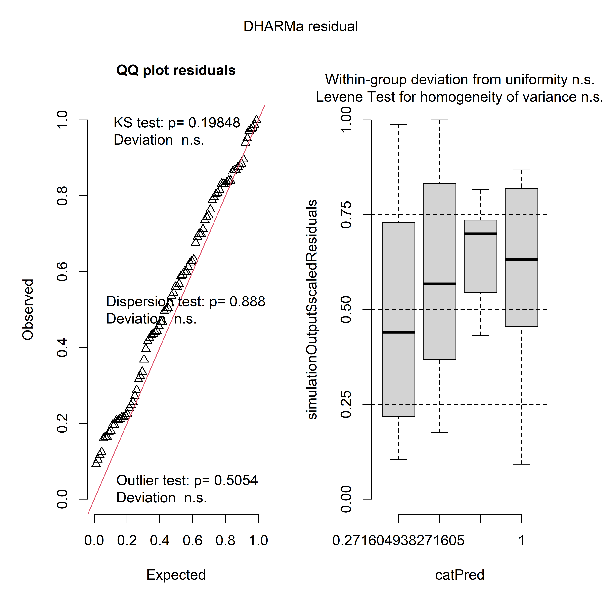

## Setup


This is an R Markdown document describing how to use EcoCoMix to conduct BEF regression, or any community-level analyses. You will need to install and load multiple packages and data.

``` r
library(phytools)
library(tidyverse)
library(EcoCoMix)
data("KSR")
data("KSR_MLtree")
data("KSR_EF")
```

Let's get the variane covariance matrix at species and community level.

``` r
VCV_sp <- vcv(KSR_MLtree) #species level phyologenetic covariance matrix using default (Brownian) model
VCV_sp <- VCV_sp[order(rownames(VCV_sp)),order(colnames(VCV_sp))]
VCV_comm <- get_comm_pair_r(KSR,VCV_sp)
head(VCV_comm)
#> $corM
#>            [,1]      [,2]      [,3]      [,4]      [,5]      [,6]      [,7]      [,8]      [,9]     [,10]
#>  [1,] 1.0000000 0.7031684 0.5639613 0.5601338 0.7539050 0.4601493 0.9925160 0.8712607 0.9701760 0.5601338
#>  [2,] 0.7031684 1.0000000 0.5458040 0.5420997 0.7048551 0.8307889 0.7029690 0.8684925 0.6922475 0.5420997
#>  [3,] 0.5639613 0.5458040 1.0000000 0.9932131 0.5749538 0.4632936 0.5682138 0.5704439 0.5639613 0.9923064
#>  [4,] 0.5601338 0.5420997 0.9932131 1.0000000 0.5710517 0.4601493 0.5643575 0.5665724 0.5601338 0.9729447
#>  [5,] 0.7539050 0.7048551 0.5749538 0.5710517 1.0000000 0.4533839 0.7669916 0.8849588 0.7685978 0.5710517
#>  [6,] 0.4601493 0.8307889 0.4632936 0.4601493 0.4533839 1.0000000 0.4636191 0.6198279 0.4601493 0.4601493
#>  [7,] 0.9925160 0.7029690 0.5682138 0.5643575 0.7669916 0.4636191 1.0000000 0.8778304 0.9925160 0.5643575
#>  [8,] 0.8712607 0.8684925 0.5704439 0.5665724 0.8849588 0.6198279 0.8778304 1.0000000 0.8712607 0.5665724
#>  [9,] 0.9701760 0.6922475 0.5639613 0.5601338 0.7685978 0.4601493 0.9925160 0.8712607 1.0000000 0.5601338
#> [10,] 0.5601338 0.5420997 0.9923064 0.9729447 0.5710517 0.4601493 0.5643575 0.5665724 0.5601338 1.0000000
#> [11,] 0.8663302 0.6987816 0.8815386 0.8678976 0.7583946 0.5209942 0.8813682 0.8139778 0.8832140 0.8821943
#>           [,11]     [,12]     [,13]     [,14]     [,15]     [,16]     [,17]     [,18]     [,19]     [,20]
#>  [1,] 0.8663302 0.5420997 0.5153012 0.5601338 0.5970450 0.3960744 0.2543211 0.7657388 0.3960744 0.3960744
#>  [2,] 0.6987816 0.8788518 0.7925797 0.5420997 0.8033812 0.5221973 0.5662502 0.9153193 0.6229405 0.5221973
#>  [3,] 0.8815386 0.7029860 0.7351611 0.5774423 0.8523125 0.7023078 0.4509548 0.6179481 0.4264599 0.7023078
#>  [4,] 0.8678976 0.7031684 0.7237942 0.5735233 0.8544441 0.6879758 0.4540363 0.6137542 0.4235655 0.7071068
#>  [5,] 0.7583946 0.7215393 0.7662140 0.5584946 0.5994749 0.7397582 0.4992201 0.8490621 0.7303210 0.7521497
#>  [6,] 0.5209942 0.8307889 0.6408267 0.4601493 0.8544441 0.3253747 0.2089245 0.7278421 0.3253747 0.3253747
#>  [7,] 0.8813682 0.5461874 0.5191868 0.5643575 0.6015470 0.3990610 0.2562387 0.7658181 0.3990610 0.3990610
#>  [8,] 0.8139778 0.8177874 0.8149026 0.5665724 0.6942527 0.6451046 0.4318477 0.8527846 0.5365890 0.6541218
#>  [9,] 0.8832140 0.5420997 0.5153012 0.5601338 0.5970450 0.3960744 0.2543211 0.7544347 0.3960744 0.3960744
#> [10,] 0.8821943 0.6932614 0.7374587 0.5735233 0.8386120 0.7058332 0.4417522 0.6137542 0.4235655 0.6879758
#> [11,] 1.0000000 0.6993555 0.7086902 0.6417794 0.8127459 0.6245266 0.3940570 0.7745512 0.4640098 0.6136963
#>           [,21]     [,22]     [,23]     [,24]     [,25]     [,26]     [,27]     [,28]     [,29]     [,30]
#>  [1,] 0.3960744 0.7691079 0.5601338 0.0000000 0.8663302 0.0000000 0.9701760 0.3960744 0.4435879 0.8070641
#>  [2,] 0.6422483 0.7883058 0.5420997 0.1963988 0.6987816 0.1963988 0.6922475 0.5221973 0.6943516 0.7322819
#>  [3,] 0.4264599 0.6418330 0.9923064 0.0000000 0.6461649 0.0000000 0.5639613 0.7016666 0.3925181 0.7672968
#>  [4,] 0.4235655 0.6374770 0.9729447 0.0000000 0.6417794 0.0000000 0.5601338 0.6879758 0.3898542 0.7571958
#>  [5,] 0.7303210 0.8682535 0.5710517 0.4926486 0.7512859 0.4751244 0.7685978 0.7521497 0.7803840 0.8811778
#>  [6,] 0.3253747 0.5078891 0.4601493 0.0000000 0.5209942 0.0000000 0.4601493 0.3253747 0.4848212 0.4993614
#>  [7,] 0.3990610 0.7804351 0.5643575 0.0000000 0.8813682 0.0000000 0.9925160 0.3990610 0.4469327 0.8185846
#>  [8,] 0.5365890 0.8081957 0.5665724 0.3584955 0.8139778 0.3457433 0.8712607 0.6541218 0.7871559 0.8866129
#>  [9,] 0.3960744 0.7800807 0.5601338 0.0000000 0.8832140 0.0000000 1.0000000 0.3960744 0.4435879 0.8178526
#> [10,] 0.4235655 0.6374770 1.0000000 0.0000000 0.6417794 0.0000000 0.5601338 0.7071068 0.3898542 0.7663313
#> [11,] 0.4640098 0.8024996 0.8821943 0.0000000 0.8633205 0.0000000 0.8832140 0.6238056 0.4718234 0.8971979
#>           [,31]     [,32]     [,33]     [,34]     [,35]     [,36]     [,37]     [,38]     [,39]     [,40]
#>  [1,] 0.5970450 0.5420997 0.0000000 0.5601338 0.9701760 0.0000000 0.4955119 0.3253747 0.5601338 0.5601338
#>  [2,] 0.8033812 0.8788518 0.3388712 0.5420997 0.6922475 0.3388712 0.5586090 0.7263314 0.5420997 0.5420997
#>  [3,] 0.6240309 0.7029860 0.0000000 0.9932131 0.5639613 0.0000000 0.3987809 0.3275981 0.9932131 0.5774423
#>  [4,] 0.6197957 0.7031684 0.0000000 1.0000000 0.5601338 0.0000000 0.3960744 0.3253747 1.0000000 0.5735233
#>  [5,] 0.7150741 0.7215393 0.2642321 0.5710517 0.7685978 0.2642321 0.7752025 0.6689460 0.5710517 0.5584946
#>  [6,] 0.7424830 0.8307889 0.0000000 0.4601493 0.4601493 0.0000000 0.3253747 0.7071068 0.4601493 0.4601493
#>  [7,] 0.6015470 0.5461874 0.0000000 0.5643575 0.9925160 0.0000000 0.4992483 0.3278282 0.5643575 0.5643575
#>  [8,] 0.7343902 0.8177874 0.1922791 0.5665724 0.8712607 0.1922791 0.7164004 0.6917791 0.5665724 0.5665724
#>  [9,] 0.5970450 0.5420997 0.0000000 0.5601338 1.0000000 0.0000000 0.4955119 0.3253747 0.5601338 0.5601338
#> [10,] 0.6197957 0.6932614 0.0000000 0.9729447 0.5601338 0.0000000 0.3960744 0.3253747 0.9729447 0.5735233
#> [11,] 0.6888708 0.6993555 0.0000000 0.8678976 0.8832140 0.0000000 0.5047397 0.3683985 0.8678976 0.6417794
#>           [,41]     [,42]     [,43]     [,44]     [,45]     [,46]     [,47]     [,48]     [,49]     [,50]
#>  [1,] 0.5601338 0.0000000 0.8369918 1.0000000 0.0000000 0.7007597 0.0000000 0.6018610 0.5420997 0.5970450
#>  [2,] 0.5420997 0.3661766 0.8912441 0.7031684 0.1963988 0.5935936 0.1963988 0.6908621 0.8788518 0.8033812
#>  [3,] 0.9932131 0.0000000 0.6011248 0.5639613 0.0000000 0.5639613 0.0000000 0.9677983 0.7029860 0.6090135
#>  [4,] 0.9729447 0.0000000 0.5970450 0.5601338 0.0000000 0.5601338 0.0000000 0.9576796 0.7031684 0.6048802
#>  [5,] 0.5710517 0.2642321 0.7150741 0.7539050 0.4926486 0.6211775 0.4751244 0.6091681 0.7215393 0.5921268
#>  [6,] 0.4601493 0.0000000 0.7424830 0.4601493 0.0000000 0.4601493 0.0000000 0.6155170 0.8307889 0.8544441
#>  [7,] 0.5643575 0.0000000 0.8520950 0.9925160 0.0000000 0.7060437 0.0000000 0.6063993 0.5461874 0.6015470
#>  [8,] 0.5665724 0.1922791 0.9126865 0.8712607 0.3584955 0.6673999 0.3457433 0.6714746 0.8177874 0.6942527
#>  [9,] 0.5601338 0.0000000 0.8544441 0.9701760 0.0000000 0.7007597 0.0000000 0.6018610 0.5420997 0.5970450
#> [10,] 0.9981989 0.0000000 0.5970450 0.5601338 0.0000000 0.5601338 0.0000000 0.9647804 0.6932614 0.6048802
#> [11,] 0.8832140 0.0000000 0.8217086 0.8663302 0.0000000 0.7138098 0.0000000 0.8868980 0.6993555 0.6804270
#>           [,51]     [,52]     [,53]     [,54]     [,55]     [,56]     [,57]     [,58]     [,59]     [,60]
#>  [1,] 0.6314954 0.5601338 0.6149360 0.3960744 0.3960744 0.3253747 0.4601493 0.5601338 0.7539050 0.9925160
#>  [2,] 0.6111637 0.5420997 0.7110988 0.6422483 0.6422483 0.7263314 0.8307889 0.5420997 0.7750439 0.7029690
#>  [3,] 0.8853793 0.6031053 0.6257313 0.7023078 0.4083134 0.3275981 0.4632936 0.5774423 0.5623110 0.5682138
#>  [4,] 0.8717448 0.5990121 0.6160486 0.7071068 0.4055422 0.3253747 0.4601493 0.5735233 0.5584946 0.5643575
#>  [5,] 0.6367258 0.7685978 0.8424647 0.5906348 0.5817557 0.6689460 0.4533839 0.5584946 0.7839639 0.7669916
#>  [6,] 0.5187728 0.4601493 0.3698106 0.3253747 0.3253747 0.5718168 0.8086711 0.4601493 0.4533839 0.4636191
#>  [7,] 0.6362571 0.5643575 0.6256103 0.3990610 0.3990610 0.3278282 0.4636191 0.5643575 0.7669916 1.0000000
#>  [8,] 0.6387542 0.5665724 0.7990974 0.5365890 0.5365890 0.7402799 0.6884184 0.5665724 0.8030725 0.8778304
#>  [9,] 0.6314954 0.5601338 0.6269205 0.3960744 0.3960744 0.3253747 0.4601493 0.5601338 0.7685978 0.9925160
#> [10,] 0.8859806 0.5990121 0.6261967 0.6879758 0.4055422 0.3253747 0.4601493 0.5735233 0.5584946 0.5643575
#> [11,] 0.8596395 0.6562090 0.7098172 0.6136963 0.4538066 0.3683985 0.5209942 0.6417794 0.7512859 0.8813682
#>           [,61]     [,62]     [,63]     [,64]     [,65]     [,66]     [,67]     [,68]     [,69]     [,70]
#>  [1,] 0.5601338 0.4601493 1.0000000 0.0000000 0.7918957 0.0000000 0.7007597 0.6676856 0.0000000 0.5601338
#>  [2,] 0.5420997 0.8307889 0.7031684 0.3053605 0.9225930 0.3661766 0.5935936 0.7494282 0.1963988 0.5420997
#>  [3,] 0.9932131 0.4632936 0.5639613 0.0000000 0.5912844 0.0000000 0.5639613 0.7920737 0.0000000 0.9932131
#>  [4,] 0.9729447 0.4601493 0.5601338 0.0000000 0.5872715 0.0000000 0.5601338 0.7817380 0.0000000 0.9729447
#>  [5,] 0.5710517 0.4533839 0.7539050 0.4217876 0.7830913 0.2642321 0.6211775 0.8158252 0.4926486 0.5710517
#>  [6,] 0.4601493 0.8086711 0.4601493 0.0000000 0.7135691 0.0000000 0.4601493 0.5061458 0.0000000 0.4601493
#>  [7,] 0.5643575 0.4636191 0.9925160 0.0000000 0.8034500 0.0000000 0.7060437 0.6727203 0.0000000 0.5643575
#>  [8,] 0.5665724 0.6884184 0.8712607 0.3069306 0.8735282 0.1922791 0.6673999 0.7306753 0.3584955 0.5665724
#>  [9,] 0.5601338 0.4601493 0.9701760 0.0000000 0.8029781 0.0000000 0.7007597 0.6676856 0.0000000 0.5601338
#> [10,] 0.9981989 0.4601493 0.5601338 0.0000000 0.5872715 0.0000000 0.5601338 0.7909976 0.0000000 0.9981989
#> [11,] 0.8832140 0.5209942 0.8663302 0.0000000 0.7870401 0.0000000 0.7138098 0.8261552 0.0000000 0.8832140
#>           [,71]     [,72]     [,73]     [,74]     [,75]     [,76]     [,77]     [,78]     [,79]     [,80]
#>  [1,] 0.9701760 0.4601493 0.9701760 0.9442449 0.0000000 0.4601493 0.5601338 0.9040528 0.0000000 0.5601338
#>  [2,] 0.6922475 0.8307889 0.6922475 0.7230298 0.3661766 0.8307889 0.5420997 0.8368928 0.1963988 0.5420997
#>  [3,] 0.5639613 0.4632936 0.5639613 0.6363972 0.0000000 0.4632936 0.9923064 0.7813050 0.0000000 0.6031053
#>  [4,] 0.5601338 0.4601493 0.5601338 0.6320781 0.0000000 0.4601493 0.9729447 0.7800920 0.0000000 0.5990121
#>  [5,] 0.7685978 0.4533839 0.7685978 0.7765734 0.2642321 0.4533839 0.5710517 0.7699710 0.4751244 0.7685978
#>  [6,] 0.4601493 0.8086711 0.4601493 0.5151468 0.0000000 1.0000000 0.4601493 0.7196389 0.0000000 0.4601493
#>  [7,] 0.9925160 0.4636191 0.9925160 0.9513649 0.0000000 0.4636191 0.5643575 0.9108698 0.0000000 0.5643575
#>  [8,] 0.8712607 0.6884184 0.8712607 0.8616929 0.1922791 0.6198279 0.5665724 0.8854493 0.3457433 0.5665724
#>  [9,] 1.0000000 0.4601493 1.0000000 0.9442449 0.0000000 0.4601493 0.5601338 0.9040528 0.0000000 0.5601338
#> [10,] 0.5601338 0.4601493 0.5601338 0.6320781 0.0000000 0.4601493 1.0000000 0.7719129 0.0000000 0.5990121
#> [11,] 0.8832140 0.5209942 0.8832140 0.8923789 0.0000000 0.5209942 0.8821943 0.9487881 0.0000000 0.6562090
#>           [,81]     [,82]     [,83]     [,84]     [,85]     [,86]     [,87]     [,88]
#>  [1,] 0.8663302 0.4601493 0.4838759 0.9701760 0.9925160 0.8369918 0.5601338 0.7918957
#>  [2,] 0.6987816 0.8307889 0.8736267 0.6922475 0.7029690 0.8912441 0.5420997 0.8595048
#>  [3,] 0.6461649 0.4632936 0.4871823 0.5639613 0.5682138 0.6011248 0.9923064 0.5912844
#>  [4,] 0.6417794 0.4601493 0.4838759 0.5601338 0.5643575 0.5970450 0.9729447 0.5872715
#>  [5,] 0.7512859 0.4533839 0.4767616 0.7685978 0.7669916 0.7150741 0.5710517 0.8679693
#>  [6,] 0.5209942 1.0000000 0.9509656 0.4601493 0.4636191 0.7424830 0.4601493 0.7135691
#>  [7,] 0.8813682 0.4636191 0.4875245 0.9925160 1.0000000 0.8520950 0.5643575 0.8034500
#>  [8,] 0.8139778 0.6198279 0.6878515 0.8712607 0.8778304 0.9126865 0.5665724 0.9352930
#>  [9,] 0.8832140 0.4601493 0.4838759 1.0000000 0.9925160 0.8544441 0.5601338 0.8029781
#> [10,] 0.6417794 0.4601493 0.4838759 0.5601338 0.5643575 0.5970450 1.0000000 0.5872715
#> [11,] 0.8633205 0.5209942 0.5478581 0.8832140 0.8813682 0.8217086 0.8821943 0.7870401
#>  [ reached getOption("max.print") -- omitted 77 rows ]
#> 
#> $covM
#>            [,1]      [,2]      [,3]      [,4]     [,5]     [,6]     [,7]      [,8]      [,9]     [,10]    [,11]
#>  [1,] 150.00000  288.0448  168.0401  84.02007 229.5465  69.0224 295.5264  364.5488 145.52640  84.02007 229.5465
#>  [2,] 288.04480 1118.6909  444.1297 222.06487 586.0886 340.3231 571.6160  992.3916 283.57119 222.06487 505.6361
#>  [3,] 168.04014  444.1297  591.8834 295.94171 347.7438 138.0448 336.0803  474.1251 168.04014 295.67154 463.9818
#>  [4,]  84.02007  222.0649  295.9417 150.00000 173.8719  69.0224 168.0401  237.0625  84.02007 145.94171 229.9618
#>  [5,] 229.54647  586.0886  347.7438 173.87189 618.0401 138.0448 463.5665  751.6113 234.02007 173.87189 407.8920
#>  [6,]  69.02240  340.3231  138.0448  69.02240 138.0448 150.0000 138.0448  259.3455  69.02240  69.02240 138.0448
#>  [7,] 295.52640  571.6160  336.0803 168.04014 463.5665 138.0448 591.0528  729.0976 295.52640 168.04014 463.5665
#>  [8,] 364.54879  992.3916  474.1251 237.06254 751.6113 259.3455 729.0976 1167.1424 364.54879 237.06254 601.6113
#>  [9,] 145.52640  283.5712  168.0401  84.02007 234.0201  69.0224 295.5264  364.5488 150.00000  84.02007 234.0201
#> [10,]  84.02007  222.0649  295.6715 145.94171 173.8719  69.0224 168.0401  237.0625  84.02007 150.00000 233.7499
#> [11,] 229.54647  505.6361  463.9818 229.96178 407.8920 138.0448 463.5665  601.6113 234.02007 233.74991 468.0401
#>           [,12]    [,13]     [,14]    [,15]     [,16]     [,17]     [,18]     [,19]     [,20]     [,21]
#>  [1,]  222.0649 153.0425  84.02007 153.0425  84.02007  84.02007  303.0425  84.02007  84.02007  84.02007
#>  [2,]  983.1635 642.8404 222.06487 562.3879 302.51737 510.87954  989.2474 360.87954 302.51737 372.06487
#>  [3,]  572.0313 433.7163 172.05700 433.9865 295.94171 295.94171  485.7886 179.70364 295.94171 179.70364
#>  [4,]  288.0448 214.9641  86.02850 219.0224 145.94171 150.00000  242.8943  89.85182 150.00000  89.85182
#>  [5,]  599.9615 461.9167 170.04857 311.9167 318.53618 334.77689  682.0638 314.47257 323.87189 314.47257
#>  [6,]  340.3231 190.3231  69.02240 219.0224  69.02240  69.02240  288.0448  69.02240  69.02240  69.02240
#>  [7,]  444.1297 306.0849 168.04014 306.0849 168.04014 168.04014  601.6113 168.04014 168.04014 168.04014
#>  [8,]  934.4528 675.1073 237.06254 496.4080 381.72683 397.96754  941.4093 317.51504 387.06254 317.51504
#>  [9,]  222.0649 153.0425  84.02007 153.0425  84.02007  84.02007  298.5689  84.02007  84.02007  84.02007
#> [10,]  283.9865 219.0224  86.02850 214.9641 149.72984 145.94171  242.8943  89.85182 145.94171  89.85182
#> [11,]  506.0514 371.7947 170.04857 368.0066 234.02007 229.96178  541.4632 173.87189 229.96178 173.87189
#>           [,22]     [,23]    [,24]    [,25]    [,26]     [,27]     [,28]     [,29]     [,30]    [,31]     [,32]
#>  [1,]  313.5665  84.02007   0.0000 229.5465   0.0000 145.52640  84.02007  174.1364  334.6604 153.0425  222.0649
#>  [2,]  877.7009 222.06487  80.4525 505.6361  80.4525 283.57119 302.51737  744.3868  829.2473 562.3879  983.1635
#>  [3,]  519.8008 295.67154   0.0000 340.0971   0.0000 168.04014 295.67154  306.0849  632.0220 317.7484  572.0313
#>  [4,]  259.9004 145.94171   0.0000 170.0486   0.0000  84.02007 145.94171  153.0425  313.9818 158.8742  288.0448
#>  [5,]  718.5412 173.87189 150.0000 404.0686 144.6643 234.02007 323.87189  621.8431  741.6903 372.0649  599.9615
#>  [6,]  207.0672  69.02240   0.0000 138.0448   0.0000  69.02240  69.02240  190.3231  207.0672 190.3231  340.3231
#>  [7,]  631.6067 168.04014   0.0000 463.5665   0.0000 295.52640 168.04014  348.2727  673.7944 306.0849  444.1297
#>  [8,]  919.1264 237.06254 150.0000 601.6113 144.6643 364.54879 387.06254  861.9594 1025.5259 525.1073  934.4528
#>  [9,]  318.0401  84.02007   0.0000 234.0201   0.0000 150.00000  84.02007  174.1364  339.1340 153.0425  222.0649
#> [10,]  259.9004 150.00000   0.0000 170.0486   0.0000  84.02007 150.00000  153.0425  317.7700 158.8742  283.9865
#> [11,]  577.9405 233.74991   0.0000 404.0686   0.0000 234.02007 233.74991  327.1788  657.1742 311.9167  506.0514
#>          [,33]     [,34]     [,35]    [,36]     [,37]    [,38]     [,39]     [,40]     [,41]    [,42]    [,43]
#>  [1,]   0.0000  84.02007 145.52640   0.0000 105.11395  69.0224  84.02007  84.02007  84.02007   0.0000 214.5488
#>  [2,] 138.8147 222.06487 283.57119 138.8147 323.61125 420.7756 222.06487 222.06487 222.06487 150.0000 623.8943
#>  [3,]   0.0000 295.94171 168.04014   0.0000 168.04014 138.0448 295.94171 172.05700 295.94171   0.0000 306.0849
#>  [4,]   0.0000 150.00000  84.02007   0.0000  84.02007  69.0224 150.00000  86.02850 145.94171   0.0000 153.0425
#>  [5,]  80.4525 173.87189 234.02007  80.4525 333.79831 288.0448 173.87189 170.04857 173.87189  80.4525 372.0649
#>  [6,]   0.0000  69.02240  69.02240   0.0000  69.02240 150.0000  69.02240  69.02240  69.02240   0.0000 190.3231
#>  [7,]   0.0000 168.04014 295.52640   0.0000 210.22791 138.0448 168.04014 168.04014 168.04014   0.0000 433.5712
#>  [8,]  80.4525 237.06254 364.54879  80.4525 423.91460 409.3455 237.06254 237.06254 237.06254  80.4525 652.5936
#>  [9,]   0.0000  84.02007 150.00000   0.0000 105.11395  69.0224  84.02007  84.02007  84.02007   0.0000 219.0224
#> [10,]   0.0000 145.94171  84.02007   0.0000  84.02007  69.0224 145.94171  86.02850 149.72984   0.0000 153.0425
#> [11,]   0.0000 229.96178 234.02007   0.0000 189.13402 138.0448 229.96178 170.04857 234.02007   0.0000 372.0649
#>           [,44]    [,45]     [,46]    [,47]     [,48]     [,49]    [,50]    [,51]     [,52]    [,53]     [,54]
#>  [1,] 150.00000   0.0000 105.11395   0.0000  321.0826  222.0649 153.0425 168.0401  84.02007 229.5465  84.02007
#>  [2,] 288.04480  80.4525 243.15875  80.4525 1006.5177  983.1635 562.3879 444.1297 222.06487 724.9032 372.06487
#>  [3,] 168.04014   0.0000 168.04014   0.0000 1025.5998  572.0313 310.1018 467.9987 179.70364 463.9818 295.94171
#>  [4,]  84.02007   0.0000  84.02007   0.0000  510.9058  288.0448 155.0509 231.9702  89.85182 229.9618 150.00000
#>  [5,] 229.54647 150.0000 189.13402 144.6643  659.6605  599.9615 308.0934 343.9205 234.02007 638.3445 254.32439
#>  [6,]  69.02240   0.0000  69.02240   0.0000  328.3679  340.3231 219.0224 138.0448  69.02240 138.0448  69.02240
#>  [7,] 295.52640   0.0000 210.22791   0.0000  642.1652  444.1297 306.0849 336.0803 168.04014 463.5665 168.04014
#>  [8,] 364.54879 150.0000 279.25030 144.6643  999.2324  934.4528 496.4080 474.1251 237.06254 832.0638 317.51504
#>  [9,] 145.52640   0.0000 105.11395   0.0000  321.0826  222.0649 153.0425 168.0401  84.02007 234.0201  84.02007
#> [10,]  84.02007   0.0000  84.02007   0.0000  514.6939  283.9865 155.0509 235.7583  89.85182 233.7499 145.94171
#> [11,] 229.54647   0.0000 189.13402   0.0000  835.7766  506.0514 308.0934 404.0686 173.87189 468.0401 229.96178
#>           [,55]    [,56]    [,57]     [,58]    [,59]    [,60]     [,61]    [,62]     [,63]    [,64]     [,65]
#>  [1,]  84.02007  69.0224  69.0224  84.02007 229.5465 295.5264  84.02007  69.0224 150.00000   0.0000  319.6627
#>  [2,] 372.06487 420.7756 340.3231 222.06487 644.4507 571.6160 222.06487 340.3231 288.04480 219.2672 1017.0530
#>  [3,] 172.05700 138.0448 138.0448 172.05700 340.0971 336.0803 295.94171 138.0448 168.04014   0.0000  474.1251
#>  [4,]  86.02850  69.0224  69.0224  86.02850 170.0486 168.0401 145.94171  69.0224  84.02007   0.0000  237.0625
#>  [5,] 250.50107 288.0448 138.0448 170.04857 484.5211 463.5665 173.87189 138.0448 229.54647 225.1168  641.6514
#>  [6,]  69.02240 121.3007 121.3007  69.02240 138.0448 138.0448  69.02240 121.3007  69.02240   0.0000  288.0448
#>  [7,] 168.04014 138.0448 138.0448 168.04014 463.5665 591.0528 168.04014 138.0448 295.52640   0.0000  643.7991
#>  [8,] 317.51504 438.0448 288.0448 237.06254 682.0638 729.0976 237.06254 288.0448 364.54879 225.1168  983.5971
#>  [9,]  84.02007  69.0224  69.0224  84.02007 234.0201 295.5264  84.02007  69.0224 145.52640   0.0000  324.1364
#> [10,]  86.02850  69.0224  69.0224  86.02850 170.0486 168.0401 149.72984  69.0224  84.02007   0.0000  237.0625
#> [11,] 170.04857 138.0448 138.0448 170.04857 404.0686 463.5665 234.02007 138.0448 229.54647   0.0000  561.1989
#>          [,66]     [,67]     [,68]    [,69]     [,70]     [,71]    [,72]     [,73]     [,74]    [,75]    [,76]
#>  [1,]   0.0000 105.11395  273.1541   0.0000  84.02007 145.52640  69.0224 145.52640  379.5465   0.0000  69.0224
#>  [2,] 150.0000 243.15875  837.2885  80.4525 222.06487 283.57119 340.3231 283.57119  793.6809 150.0000 340.3231
#>  [3,]   0.0000 168.04014  643.6855   0.0000 295.94171 168.04014 138.0448 168.04014  508.1373   0.0000 138.0448
#>  [4,]   0.0000  84.02007  319.8136   0.0000 145.94171  84.02007  69.0224  84.02007  254.0686   0.0000  69.0224
#>  [5,]  80.4525 189.13402  677.4785 150.0000 173.87189 234.02007 138.0448 234.02007  633.6151  80.4525 138.0448
#>  [6,]   0.0000  69.02240  207.0672   0.0000  69.02240  69.02240 121.3007  69.02240  207.0672   0.0000 150.0000
#>  [7,]   0.0000 210.22791  546.3082   0.0000 168.04014 295.52640 138.0448 295.52640  759.0929   0.0000 138.0448
#>  [8,]  80.4525 279.25030  833.8279 150.0000 237.06254 364.54879 288.0448 364.54879  966.1601  80.4525 259.3455
#>  [9,]   0.0000 105.11395  273.1541   0.0000  84.02007 150.00000  69.0224 150.00000  379.5465   0.0000  69.0224
#> [10,]   0.0000  84.02007  323.6017   0.0000 149.72984  84.02007  69.0224  84.02007  254.0686   0.0000  69.0224
#> [11,]   0.0000 189.13402  597.0260   0.0000 234.02007 234.02007 138.0448 234.02007  633.6151   0.0000 138.0448
#>           [,77]     [,78]    [,79]     [,80]    [,81]    [,82]    [,83]     [,84]    [,85]    [,86]     [,87]
#>  [1,]  84.02007  448.5689   0.0000  84.02007 229.5465  69.0224 138.0448 145.52640 295.5264 214.5488  84.02007
#>  [2,] 222.06487 1134.0039  80.4525 222.06487 505.6361 340.3231 680.6461 283.57119 571.6160 623.8943 222.06487
#>  [3,] 295.67154  770.0668   0.0000 179.70364 340.0971 138.0448 276.0896 168.04014 336.0803 306.0849 295.67154
#>  [4,] 145.94171  387.0625   0.0000  89.85182 170.0486  69.0224 138.0448  84.02007 168.0401 153.0425 145.94171
#>  [5,] 173.87189  775.4832 144.6643 234.02007 404.0686 138.0448 276.0896 234.02007 463.5665 372.0649 173.87189
#>  [6,]  69.02240  357.0672   0.0000  69.02240 138.0448 150.0000 271.3007  69.02240 138.0448 190.3231  69.02240
#>  [7,] 168.04014  897.1377   0.0000 168.04014 463.5665 138.0448 276.0896 295.52640 591.0528 433.5712 168.04014
#>  [8,] 237.06254 1225.5056 144.6643 237.06254 601.6113 259.3455 547.3903 364.54879 729.0976 652.5936 237.06254
#>  [9,]  84.02007  448.5689   0.0000  84.02007 234.0201  69.0224 138.0448 150.00000 295.5264 219.0224  84.02007
#> [10,] 150.00000  383.0042   0.0000  89.85182 170.0486  69.0224 138.0448  84.02007 168.0401 153.0425 150.00000
#> [11,] 233.74991  831.5731   0.0000 173.87189 404.0686 138.0448 276.0896 234.02007 463.5665 372.0649 233.74991
#>           [,88]
#>  [1,]  319.6627
#>  [2,]  947.5055
#>  [3,]  474.1251
#>  [4,]  237.0625
#>  [5,]  711.1989
#>  [6,]  288.0448
#>  [7,]  643.7991
#>  [8,] 1053.1446
#>  [9,]  324.1364
#> [10,]  237.0625
#> [11,]  561.1989
#>  [ reached getOption("max.print") -- omitted 77 rows ]
#> 
#> $comm_kronecker
#>   V1 V2 V3 V4 V5 V6 V7 V8 V9 V10 V11 V12 V13 V14 V15 V16 V17 V18 V19 V20 V21 V22 V23 V24 V25 V26 V27 V28 V29
#> 1  0  0  0  0  0  0  0  0  0   0   0   0   0   0   0   0   0   0   0   0   0   0   0   0   0   0   0   0   0
#> 2  0  0  0  0  0  0  0  0  0   0   0   0   0   0   0   0   0   0   0   0   0   0   0   0   0   0   0   0   0
#> 3  0  0  0  0  0  0  0  0  0   0   0   0   0   0   0   0   0   0   0   0   0   0   0   0   0   0   0   0   0
#> 4  0  0  0  0  0  0  0  0  0   0   0   0   0   0   0   0   0   0   0   0   0   0   0   0   0   0   0   0   0
#> 5  0  0  0  0  0  0  0  0  0   0   0   0   0   0   0   0   0   0   0   0   0   0   0   0   0   0   0   0   0
#>   V30 V31 V32 V33 V34 V35 V36 V37 V38 V39 V40 V41 V42 V43 V44 V45 V46 V47 V48 V49 V50 V51 V52 V53 V54 V55 V56
#> 1   0   0   0   0   0   0   0   0   0   0   0   0   0   0   0   0   0   0   0   0   0   0   0   0   0   0   0
#> 2   0   0   0   0   0   0   0   0   0   0   0   0   0   0   0   0   0   0   0   0   0   0   0   0   0   0   0
#> 3   0   0   0   0   0   0   0   0   0   0   0   0   0   0   0   0   0   0   0   0   0   0   0   0   0   0   0
#> 4   0   0   0   0   0   0   0   0   0   0   0   0   0   0   0   0   0   0   0   0   0   0   0   0   0   0   0
#> 5   0   0   0   0   0   0   0   0   0   0   0   0   0   0   0   0   0   0   0   0   0   0   0   0   0   0   0
#>   V57 V58 V59 V60 V61 V62 V63 V64 V65 V66 V67 V68 V69 V70 V71 V72 V73 V74 V75 V76 V77 V78 V79 V80 V81 V82 V83
#> 1   0   0   0   0   0   0   0   0   0   0   0   0   0   0   0   0   0   0   0   0   0   0   0   0   0   0   0
#> 2   0   0   0   0   0   0   0   0   0   0   0   0   0   0   0   0   0   0   0   0   0   0   0   0   0   0   0
#> 3   0   0   0   0   0   0   0   0   0   0   0   0   0   0   0   0   0   0   0   0   0   0   0   0   0   0   0
#> 4   0   0   0   0   0   0   0   0   0   0   0   0   0   0   0   0   0   0   0   0   0   0   0   0   0   0   0
#> 5   0   0   0   0   0   0   0   0   0   0   0   0   0   0   0   0   0   0   0   0   0   0   0   0   0   0   0
#>   V84 V85 V86 V87 V88 V89 V90 V91 V92 V93 V94 V95 V96 V97 V98 V99 V100 V101 V102 V103 V104 V105 V106 V107 V108
#> 1   0   0   0   0   0   0   0   0   0   0   0   0   0   0   0   0    0    0    0    0    0    0    0    0    0
#> 2   0   0   0   0   0   0   0   0   0   0   0   0   0   0   0   0    0    0    0    0    0    0    0    0    0
#> 3   0   0   0   0   0   0   0   0   0   0   0   0   0   0   0   0    0    0    0    0    0    0    0    0    0
#> 4   0   0   0   0   0   0   0   0   0   0   0   0   0   0   0   0    0    0    0    0    0    0    0    0    0
#> 5   0   0   0   0   0   0   0   0   0   0   0   0   0   0   0   0    0    0    0    0    0    0    0    0    0
#>   V109 V110 V111 V112 V113 V114 V115 V116 V117 V118 V119 V120 V121 V122 V123 V124 V125 V126 V127 V128 V129 V130
#> 1    0    0    0    0    0    0    0    0    0    0    0    0    0    0    0    0    0    0    0    0    0    0
#> 2    0    0    0    0    0    0    0    0    0    0    0    0    0    0    0    0    0    0    0    0    0    0
#> 3    0    0    0    0    0    0    0    0    0    0    0    0    0    0    0    0    0    0    0    0    0    0
#> 4    0    0    0    0    0    0    0    0    0    0    0    0    0    0    0    0    0    0    0    0    0    0
#> 5    0    0    0    0    0    0    0    0    0    0    0    0    0    0    0    0    0    0    0    0    0    0
#>   V131 V132 V133 V134 V135 V136 V137 V138 V139 V140 V141 V142 V143 V144 V145 V146 V147 V148 V149 V150 V151 V152
#> 1    0    0    0    0    0    0    0    0    0    0    0    0    0    0    0    0    0    0    0    0    0    0
#> 2    0    0    0    0    0    0    0    0    0    0    0    0    0    0    0    0    0    0    0    0    0    0
#> 3    0    0    0    0    0    0    0    0    0    0    0    0    0    0    0    0    0    0    0    0    0    0
#> 4    0    0    0    0    0    0    0    0    0    0    0    0    0    0    0    0    0    0    0    0    0    0
#> 5    0    0    0    0    0    0    0    0    0    0    0    0    0    0    0    0    0    0    0    0    0    0
#>   V153 V154 V155 V156 V157 V158 V159 V160 V161 V162 V163 V164 V165 V166 V167 V168 V169 V170 V171 V172 V173 V174
#> 1    0    0    0    0    0    0    0    0    0    0    0    0    0    0    0    0    0    0    0    0    0    0
#> 2    0    0    0    0    0    0    0    0    0    0    0    0    0    0    0    0    0    0    0    0    0    0
#> 3    0    0    0    0    0    0    0    0    0    0    0    0    0    0    0    0    0    0    0    0    0    0
#> 4    0    0    0    0    0    0    0    0    0    0    0    0    0    0    0    0    0    0    0    0    0    0
#> 5    0    0    0    0    0    0    0    0    0    0    0    0    0    0    0    0    0    0    0    0    0    0
#>   V175 V176 V177 V178 V179 V180 V181 V182 V183 V184 V185 V186 V187 V188 V189 V190 V191 V192 V193 V194 V195 V196
#> 1    0    0    0    0    0    0    0    0    0    0    0    0    0    0    0    0    0    0    0    0    0    1
#> 2    0    0    0    0    0    0    0    0    0    0    1    0    1    1    0    0    0    0    0    0    0    1
#> 3    0    0    0    0    0    0    0    0    0    0    0    0    0    0    1    0    1    0    0    0    0    0
#> 4    0    0    0    0    0    0    0    0    0    0    0    0    0    0    1    0    0    0    0    0    0    0
#> 5    0    0    0    0    0    0    0    0    1    0    0    0    0    0    0    1    0    0    0    0    1    0
#>  [ reached 'max' / getOption("max.print") -- omitted 7739 rows ]
```

The KSR_EF data have multiple ecosystem function.


``` r
head(KSR_EF)
#>   Plot Real.rich litter2012 ave.biomass  LAI mean.N.change poll_total flwr_total Mass.loss.2month Damage_effect
#> 1   X2         1      79.05    32.97333 1.67       -0.0015         20 43113.5000            3.362     0.0000000
#> 2   X3         4      74.23    82.41000 5.53       -0.0275         53  2126.1429            3.718     0.3001195
#> 3   X4         2      34.50    62.92667 3.04        0.0060        150   324.4286            3.521     0.4195279
#> 4   X7         1      36.32    34.38333 3.42       -0.0575          0     0.0000            3.328     0.0000000
#> 5   X8         3      21.46   147.05667 7.14       -0.0070          0     0.0000            3.608     2.7460093
#> 6   X9         1      37.26    33.80333 1.01        0.0415          0     0.0000            3.627     0.0000000
#>   bugs bug.rich
#> 1    9        7
#> 2    7        6
#> 3    4        2
#> 4    5        3
#> 5    4        4
#> 6   11        7
```

## Data Description


| Variable         | Description                                                      |
|-----------------|------------------------------------------------------|
| Plot             | Plot identity                                                    |
| Real.rich        | Number of species planted                                        |
| litter2012       | Amount of litter measured in 2012                                |
| ave.biomass      | Average biomass across 2012-2014                                 |
| LAI              | Leaf area index, a simplified dimension of structural complexity |
| mean.N.change    | delta 15N change averaged across surface and deep soil           |
| poll_total       | Total number of pollinators                                      |
| flwr_total       | Total number of flowers                                          |
| Mass.loss.2month  | Decomposition after 2 months                                     |
| Damage_effect    | Damage reduction effect                                          |
| bugs             | Total number of arthropods                                       |
| bug.rich         | Species richness of arthropods                                   |

## Empirical Analyses - Single Function

We repeated the analyses in [Cadotte et al. (2017)](https://esajournals.onlinelibrary.wiley.com/doi/full/10.1002/ecy.2045?casa_token=dROW6fWW92EAAAAA%3AuXcUC3seoCFkzpoV1Zb6_PSzxjkN7_8H1jhBYjjzTiF0-g3tPsfV1lFQVN4k1QiNRTLwqWbl4PW_nQ), involving ten ecosystem functions.

Let's say we are only interested in LAI. For compositional random effect, please designate the random effect as corrMatrix(1|comp_id) in EcoCoMix (even though you might not have the column comp_id in the data frame.). The function will automatically generate a column comp_id in the internal calculation (i.e., every community will have an unique identifier).


``` r
m_LAI <- EcoCoMix(LAI~Real.rich+corrMatrix(1|comp_id),
                                     data=KSR_EF,
                                     comm=KSR,
                                     VCV_sp = vcv(KSR_MLtree),
                                     method.spaMM="REML",
                                     init=list())

summary(m_LAI$best_model)
#> formula: LAI ~ Real.rich + corrMatrix(1 | comp_id)
#> Estimation of fixed effects by ML.
#> Estimation of lambda and phi by 'outer' REML, maximizing restricted logL.
#> family: gaussian( link = identity ) 
#>  ------------ Fixed effects (beta) ------------
#>             Estimate Cond. SE t-value
#> (Intercept)   2.6197   0.5147   5.089
#> Real.rich     0.7042   0.2482   2.838
#>  --------------- Random effects ---------------
#> Family: gaussian( link = identity ) 
#>            --- Variance parameters ('lambda'):
#> lambda = var(u) for u ~ Gaussian; 
#>    comp_id  :  5.407  
#> # of obs: 88; # of groups: comp_id, 88 
#>  -------------- Residual variance  ------------
#> phi estimate was 1.68569 
#>  ------------- Likelihood values  -------------
#>                         logLik
#> logL       (p_v(h)): -167.5682
#> Re.logL  (p_b,v(h)): -167.9030
m_LAI$best_model_satt #Satterthwaite's method is better for p-values.
#> Single term deletions using Satterthwaite's method:
#> 
#> Model:
#> LAI ~ Real.rich + corrMatrix(1 | comp_id)
#>           Sum Sq Mean Sq NumDF  DenDF F value Pr(>F)  
#> Real.rich 13.573  13.573     1 14.232   8.052  0.013 *
#> ---
#> Signif. codes:  0 '***' 0.001 '**' 0.01 '*' 0.05 '.' 0.1 ' ' 1
```
## Residual Checking
Let's do some model diagnostics to make sure our model makes sense. The package DHARMa supports output from spaMM, so we will use it for model diagnostics.


``` r
library(DHARMa)

sres <- simulateResiduals(m_LAI$best_model)
plot(sres)
```

<div class="figure">

<p class="caption">Outputs from DHARMa for the negative binomial model</p>
</div>

## Making figures
Let's say we want to visualize the predicted relationships between LAI and species richness. In spaMM, you can use the predict function to obtain model predictions with/without random effects. In our case, we just need to generate a new dataset that include the species richness gradient, and provide it to the predict function.


``` r
library(ggplot2)

newdata <- data.frame(Real.rich=unique(KSR_EF$Real.rich)) #create a new data frame for the predictions

predict_df <- predict(m_LAI$best_model,newdata=newdata,re.form=NA,variances=list(fixefVar=TRUE),intervals="fixefVar",binding="Response") #prediction based on fixed effect only

predict_df <- cbind(predict_df,attr(predict_df,"intervals")) #restructuring the data such that the mean predictions and their 2.5 and 97.5% CI are in the same data frame.

p <- ggplot()+
  geom_point(data=KSR_EF,aes(x=Real.rich,y=LAI))+
  geom_line(data=predict_df,aes(x=Real.rich,y=Response))+
  geom_ribbon(data=predict_df,aes(x=Real.rich,y=Response,ymin=fixefVar_0.025,ymax=fixefVar_0.975),alpha=0.3)+
  labs(x="Species richness",y = "LAI")+
  theme_classic()

plot(p)
```

<div class="figure">

<p class="caption">Predicted effects of species richness on LAI</p>
</div>
