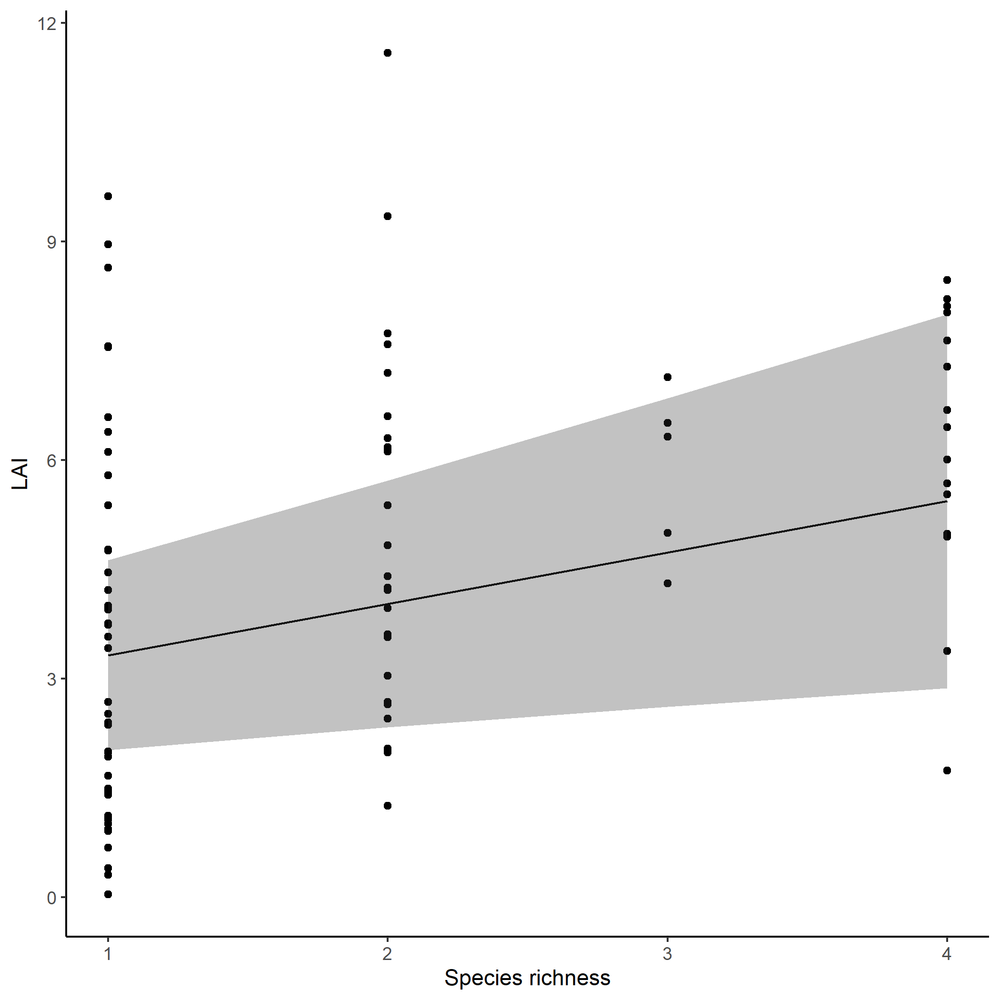

## Setup


This is an R Markdown document describing how to use EcoCoMix to conduct BEF regression, or any community-level analyses. You will need to install and load multiple packages and data.

``` r
library(phytools)
library(tidyverse)
library(EcoCoMix)
data("KSR")
data("KSR_MLtree")
data("KSR_EF")
```

Let's get the variane covariance matrix at species and community level.

``` r
VCV_sp <- vcv(KSR_MLtree) #species level phyologenetic covariance matrix using default (Brownian) model
VCV_sp <- VCV_sp[order(rownames(VCV_sp)),order(colnames(VCV_sp))]
VCV_comm <- get_comm_pair_r(KSR,VCV_sp)
```

The KSR_EF data have multiple ecosystem function.


``` r
head(KSR_EF)
#>   Plot Real.rich litter2012 ave.biomass  LAI mean.N.change poll_total flwr_total Mass.loss.2month Damage_effect
#> 1   X2         1      79.05    32.97333 1.67       -0.0015         20 43113.5000            3.362     0.0000000
#> 2   X3         4      74.23    82.41000 5.53       -0.0275         53  2126.1429            3.718     0.3001195
#> 3   X4         2      34.50    62.92667 3.04        0.0060        150   324.4286            3.521     0.4195279
#> 4   X7         1      36.32    34.38333 3.42       -0.0575          0     0.0000            3.328     0.0000000
#> 5   X8         3      21.46   147.05667 7.14       -0.0070          0     0.0000            3.608     2.7460093
#> 6   X9         1      37.26    33.80333 1.01        0.0415          0     0.0000            3.627     0.0000000
#>   bugs bug.rich
#> 1    9        7
#> 2    7        6
#> 3    4        2
#> 4    5        3
#> 5    4        4
#> 6   11        7
```

## Data Description


| Variable         | Description                                                      |
|-----------------|------------------------------------------------------|
| Plot             | Plot identity                                                    |
| Real.rich        | Number of species planted                                        |
| litter2012       | Amount of litter measured in 2012                                |
| ave.biomass      | Average biomass across 2012-2014                                 |
| LAI              | Leaf area index, a simplified dimension of structural complexity |
| mean.N.change    | delta 15N change averaged across surface and deep soil           |
| poll_total       | Total number of pollinators                                      |
| flwr_total       | Total number of flowers                                          |
| Mass.loss.2month  | Decomposition after 2 months                                     |
| Damage_effect    | Damage reduction effect                                          |
| bugs             | Total number of arthropods                                       |
| bug.rich         | Species richness of arthropods                                   |

## Empirical Analyses - Single Function

Here we reanalyze the data in [Cadotte et al. (2017)](https://esajournals.onlinelibrary.wiley.com/doi/full/10.1002/ecy.2045?casa_token=dROW6fWW92EAAAAA%3AuXcUC3seoCFkzpoV1Zb6_PSzxjkN7_8H1jhBYjjzTiF0-g3tPsfV1lFQVN4k1QiNRTLwqWbl4PW_nQ), involving ten ecosystem functions.

Let's say we are only interested in LAI. For compositional random effect, please designate the random effect as corrMatrix(1|comp_id) in EcoCoMix (even though you might not have the column comp_id in the data frame.). The function will automatically generate a column comp_id in the internal calculation (i.e., every community will have an unique identifier).


``` r
m_LAI <- EcoCoMix(LAI~Real.rich+corrMatrix(1|comp_id),
                                     data=KSR_EF,
                                     comm=KSR,
                                     VCV_sp = vcv(KSR_MLtree),
                                     method.spaMM="REML",
                                     init=list())

summary(m_LAI$best_model)
#> formula: LAI ~ Real.rich + corrMatrix(1 | comp_id)
#> Estimation of fixed effects by ML.
#> Estimation of lambda and phi by 'outer' REML, maximizing restricted logL.
#> family: gaussian( link = identity ) 
#>  ------------ Fixed effects (beta) ------------
#>             Estimate Cond. SE t-value
#> (Intercept)   2.6197   0.5147   5.089
#> Real.rich     0.7042   0.2482   2.838
#>  --------------- Random effects ---------------
#> Family: gaussian( link = identity ) 
#>            --- Variance parameters ('lambda'):
#> lambda = var(u) for u ~ Gaussian; 
#>    comp_id  :  5.407  
#> # of obs: 88; # of groups: comp_id, 88 
#>  -------------- Residual variance  ------------
#> phi estimate was 1.68569 
#>  ------------- Likelihood values  -------------
#>                         logLik
#> logL       (p_v(h)): -167.5682
#> Re.logL  (p_b,v(h)): -167.9030
m_LAI$best_model_satt #Satterthwaite's method is better for p-values.
#> Single term deletions using Satterthwaite's method:
#> 
#> Model:
#> LAI ~ Real.rich + corrMatrix(1 | comp_id)
#>           Sum Sq Mean Sq NumDF  DenDF F value Pr(>F)  
#> Real.rich 13.573  13.573     1 14.232   8.052  0.013 *
#> ---
#> Signif. codes:  0 '***' 0.001 '**' 0.01 '*' 0.05 '.' 0.1 ' ' 1
get_R2(m_LAI$best_model) #get R2 too
#>        R2m        R2c 
#> 0.07936676 0.78118520
```
## Residual Checking
Let's do some model diagnostics to make sure our model makes sense. The package DHARMa supports output from spaMM, so we will use it for model diagnostics.


``` r
library(DHARMa)
#> Warning: package 'DHARMa' was built under R version 4.3.3
#> This is DHARMa 0.4.7. For overview type '?DHARMa'. For recent changes, type news(package = 'DHARMa')

sres <- simulateResiduals(m_LAI$best_model)
plot(sres)
```

<div class="figure">

<p class="caption">Outputs from DHARMa for the negative binomial model</p>
</div>

## Making figures
Let's say we want to visualize the predicted relationships between LAI and species richness. In spaMM, you can use the predict function to obtain model predictions with/without random effects. In our case, we just need to generate a new dataset that include the species richness gradient, and provide it to the predict function.


``` r
library(ggplot2)

newdata <- data.frame(Real.rich=unique(KSR_EF$Real.rich)) #create a new data frame for the predictions

predict_df <- predict(m_LAI$best_model,newdata=newdata,re.form=NA,variances=list(fixefVar=TRUE),intervals="fixefVar",binding="Response") #prediction based on fixed effect only

predict_df <- cbind(predict_df,attr(predict_df,"intervals")) #restructuring the data such that the mean predictions and their 2.5 and 97.5% CI are in the same data frame.

p <- ggplot()+
  geom_point(data=KSR_EF,aes(x=Real.rich,y=LAI))+
  geom_line(data=predict_df,aes(x=Real.rich,y=Response))+
  geom_ribbon(data=predict_df,aes(x=Real.rich,y=Response,ymin=fixefVar_0.025,ymax=fixefVar_0.975),alpha=0.3)+
  labs(x="Species richness",y = "LAI")+
  theme_classic()

plot(p)
```

<div class="figure">

<p class="caption">Predicted effects of species richness on LAI</p>
</div>
